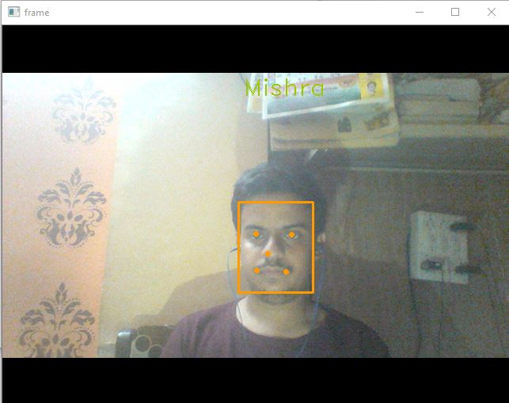

# face recognition using MTCNN   
This is a different face recognition project ,here we didn't used opencv but I used MTCNN to detect faces.  
MTCNN is an upcoming face detection technology used to detect faces in real time.  
Advantage -   
It detects faces even if they are too from camera ,which is difficult in opencv  
 The part of image detected is then encoded and compared with images in dataset to give it a label.  
 
 
